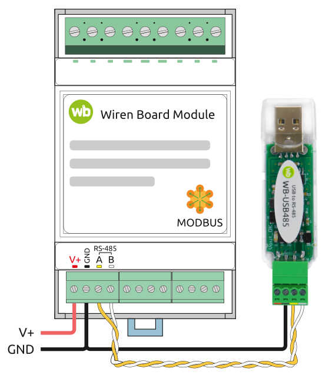

## Подключение и настройка контроллера WB-MR6LV/I

### Описание
Контроллер необходимо предварительно настроить перед монтажом.



### Сброс привязки дискретных входов
Проверки перед командой:
- убедиться, что контроллер правильно подключен к ПК (см. схему выше)
- убедиться, что контроллер в сети и отвечает

Команда проверки связи:
```
modbus_client --debug -mrtu -b9600 -pnone -s2 /dev/ttyACM0 -a90 -t0x03 -r128
```
Где:
- `/dev/ttyACM0` — USB-RS485 адаптер в ПК
- `-a90` — slave id контроллера

Ожидаемый ответ: `SUCCESS`.

Команда сброса привязки дискретных входов к релейным выходам:
```
modbus_client --debug -mrtu -b9600 -pnone -s2 /dev/ttyACM0 -a90 -t0x10 -r9 3 3 3 3 3 3
```

### Источники
- https://wiki.wirenboard.com/wiki/Working_with_WB_devices_without_a_controller
- https://wiki.wirenboard.com/wiki/Modbus-client

### Диагностика через CLI
Для проверки дискретных входов и реле используйте тестовый скрипт:
```
python -m gravity_controller_operator.diagnostics_cli --device /dev/ttyACM0 --slave-id 90 --mode full
```
Режимы:
- `full` — DI + реле
- `di` — только дискретные входы
- `relays` — только реле